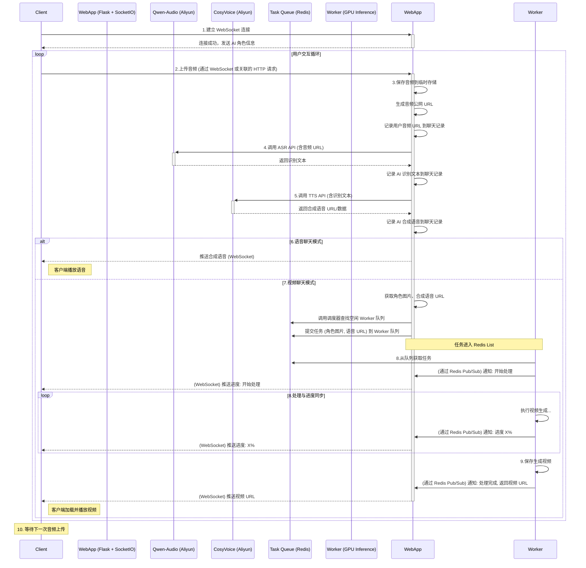

# 系统交互流程详解

本文档详细描述了用户与 EchoMimic 系统进行交互时的端到端流程，涵盖了从 WebSocket 连接建立到视频/音频结果返回的各个环节。

## 交互步骤

1.  **建立连接与初始化**: 
    *   用户通过客户端与服务器建立 WebSocket 连接，**并指定所需的交互模式（语音聊天 或 视频聊天）**。
    *   服务器在连接建立时，为该用户会话初始化相关信息，包括：
        *   空的聊天记录列表。
        *   **确认并存储用户选择的交互模式**。
        *   加载并准备发送给客户端的**当前 AI 角色的配置信息**（如角色 ID, 名称, 性格描述文本, **角色参考图片 URL**）。
    *   服务器通过 WebSocket **向客户端发送确认消息**，包含会话 ID、**已确认的交互模式**和完整的 AI 角色信息。

2.  **用户发起交互 (上传音频)**:
    *   WebSocket 连接确认成功后，用户通过客户端界面上传一段语音音频。

3.  **音频处理与存储**:
    *   服务器 (WebApp) 接收到用户上传的音频文件。
    *   将音频文件保存到一个临时存储位置（例如，服务器本地的 `tmp/` 目录或对象存储服务）。
    *   **关键**: 确保该音频文件可以通过一个公开可访问的 URL 被外部服务（如阿里云 API）访问。这可能涉及配置静态文件服务或使用云存储的公开链接。
    *   将这个公开可访问的音频文件 URL 存储到当前用户的聊天记录中（标记为用户输入）。

4.  **语音转文字 (ASR)**:
    *   服务器调用阿里云 **Qwen-Audio (语音识别)** API。
    *   将上一步获取的音频文件 URL 作为输入传递给 Qwen-Audio 服务。
    *   获取 Qwen-Audio 返回的识别结果（文字文本）。
    *   将识别出的用户文本存储到当前用户的聊天记录中（与音频对应）。

5.  **文字生成语音 (TTS)**:
    *   服务器调用阿里云 **CosyVoice (语音合成)** API。
    *   将 Qwen-Audio 返回的文字文本作为输入传递给 CosyVoice 服务。
    *   (可选) 可能需要指定 CosyVoice 使用特定音色（如果角色有配置）。
    *   获取 CosyVoice 服务返回的合成语音音频数据或其 URL。
    *   将合成的 AI 语音（的 URL 或标识）存储到聊天记录中（标记为 AI 回答）。

6.  **判断模式并处理**: 
    *   服务器**根据本次连接初始化时确定的交互模式**进行处理：
        *   **如果模式为"语音聊天"**: 服务器直接通过 WebSocket 将第 5 步获取的合成语音音频推送给客户端进行播放。
        *   **如果模式为"视频聊天"**: 进入下一步（任务入队）。

7.  **视频聊天处理 (任务入队)**:
    *   (此步骤仅在模式为"视频聊天"时执行)
    *   服务器准备将任务分发给后台 Worker：
        *   获取 AI 角色的参考图片路径或 URL (已在连接时获取并存储)。
        *   获取第 5 步生成的合成语音音频的路径或 URL。
        *   构建一个包含这些信息（角色图片、语音、用户标识符、任务 ID 等）的任务消息。
        *   **调用调度器 (`scheduler.py`)** 选择一个空闲的 GPU Worker。
        *   **调用任务提交函数 (`tasks.py`)** 将任务消息发送到选定 Worker 的专属任务队列 (例如 Redis List)。

8.  **Worker 处理与进度同步**:
    *   (此步骤仅在模式为"视频聊天"时执行)
    *   后台 Worker 进程从其监听的任务队列中获取到任务。
    *   Worker 开始执行视频生成流程 (`inference/pipelines/pipeline_echo_mimic_acc.py`)。
    *   **关键**: 在处理过程中，Worker 会周期性地通过某种机制（如 Redis Pub/Sub）上报当前的处理状态或进度（例如："开始处理"、"生成中 20%"、"生成完成"）。
    *   WebApp 的 `sockets.py` 监听这些进度消息，并通过 WebSocket 将进度实时转发给对应的客户端。

9.  **视频结果推送**:
    *   (此步骤仅在模式为"视频聊天"时执行)
    *   Worker 完成视频生成，并将最终的视频文件保存到可访问的位置（如服务器本地或云存储）。
    *   Worker 将生成的视频文件的 URL 或标识通过状态更新机制（如 Redis）通知 WebApp。
    *   WebApp (或 Worker 直接通过某种方式) 将视频文件的 URL 通过 WebSocket 推送给客户端。
    *   客户端接收到视频 URL 后，加载并播放视频。

10. **等待下一次交互**:
    *   客户端播放完视频/音频后，等待用户进行下一次语音输入，流程回到第 2 步。

## 会话结束与清理

*   **触发**: 当客户端 WebSocket 连接断开 (包括异常断开) 或客户端发送 `stop_session` 事件时。
*   **动作**: 
    *   服务器识别到会话结束信号 (基于 `session_id`)。
    *   服务器定位并删除与该 `session_id` 相关的所有临时文件，包括：
        *   用户上传的原始音频文件。
        *   阿里云 TTS 生成的 AI 语音文件。
        *   (如果是视频模式) 后台 Worker 生成的最终视频文件。
    *   清理与该会话相关的内存状态（如聊天记录、模式等）。

